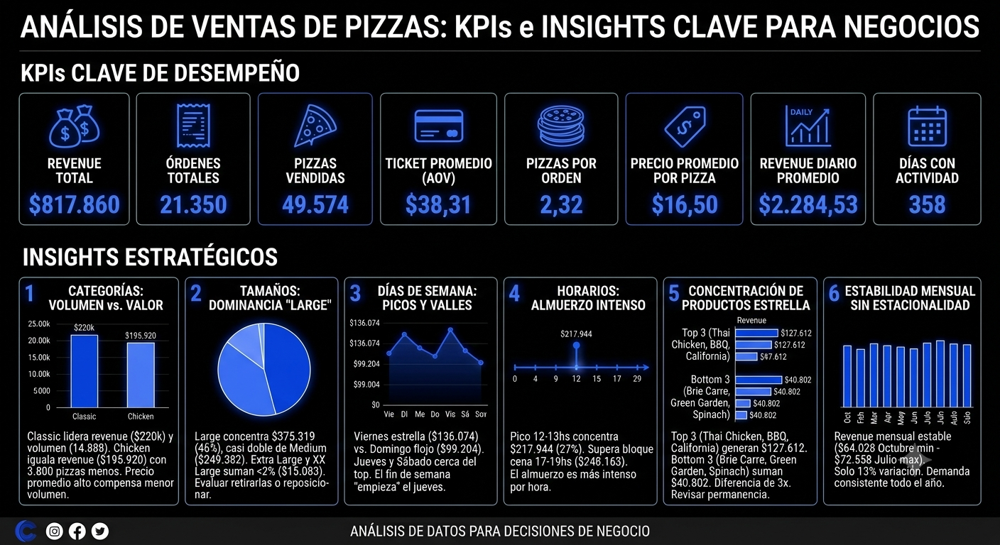

# Proyecto Analisis punto a punta ventas de Pizza    

## 📊 Fase 1 Análisis preliminar en Excel

Este proyecto inicia un proceso de analisis completo de venta de pizzas.
En base a unos datos recolectados de la operatoria tipica de una pizzeria, comenzamos buscando patrones de comportamiento
buscando tendencia, comparativas de ventas y cantidades con diferentes aperturas.

Se sumo una ilustracion resumiendo los principales hallazgos con la asistencia de Gemini Nano Banana.

Analisis completo preliminar (ETL + EDA + Calculos Estadisticos Basicos)

## 🖼️ Vista previa

🛠️En construccion...🛠️

## 🚀 Tecnologías
- Excel en primera fase para un analisis exploratorio inicial.
- Presentacion preliminar con Storytelling mostrando problemas y oportunidades de mejora.
- Desarrollo de un dashboard rapido dentro del mismo Excel.
- Armado de un dashboard mas completo en Looker Studio.
- Desarrollo de un Dashboard completo y profesional en Power BI para una presentacion al cliente final.
- Gemini Nano Banana (Ilustracion Métricas)
- Claude

#### 👨‍💻 Author
###### Gabriel Gallardo
🔗 [LinkedIn Profile](https://www.linkedin.com/in/gerardo-gabriel-gallardo-12619ab5)
